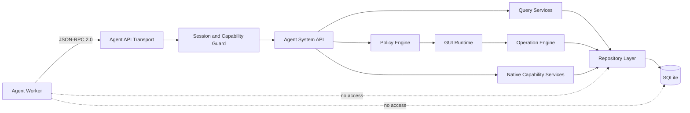

# AgentOS Agent System API

- 状态：Draft v0.1
- 目标环境：Ubuntu 24.04、Tauri 2、Rust
- 边界：Agent 只能调用本 API，不能访问数据库、Repository、文件系统或任意 Shell

## 1. 设计目标

Agent System API 向 Agent 暴露完成构建任务所需的最小系统能力，同时保持 Runtime、权限和持久化由 AgentOS 控制。

核心约束：

1. Agent 只读取受作用域限制的领域快照，不读取数据库记录。
2. Agent 只提交高层命令或 `OperationTransaction` 草案，不执行 SQL。
3. 所有写操作依次经过授权、结构校验、语义校验、预检和原子提交。
4. 高风险能力需要用户确认，Agent 不能自行提升权限。
5. 所有调用具有任务、会话和审计关联 ID。
6. API 类型与数据库 Schema 解耦，数据库迁移不改变 Agent 合约。

## 2. 架构边界



Agent Worker 与 Tauri Rust Host 之间使用 `stdin/stdout` 上的 JSON-RPC 2.0。MVP 不监听 TCP 端口，避免无意暴露本机系统能力。Rust Host 启动 Worker、创建会话并向子进程注入一次性会话凭据；凭据不写入任务提示、日志或数据库。

## 3. 会话与能力

每个 BuildTask 创建一个短生命周期 `AgentSession`：

```ts
interface AgentSessionDescriptor {
  sessionId: string;
  buildTaskId: string;
  agentId: string;
  currentSurfaceId: string;
  capabilities: AgentCapability[];
  expiresAt: string;
  apiVersion: "2026-10-01";
}

type AgentCapability =
  | "surface.read"
  | "surface.tree.read"
  | "surface.mutate"
  | "build.read"
  | "build.report"
  | "localApp.read"
  | "localApp.launch.request";
```

默认构建任务只获得：

```text
surface.read
surface.tree.read
surface.mutate
build.read
build.report
```

能力由用户发起的任务上下文决定。Agent 不能调用 grant、refresh 或 impersonate；过期、取消任务或 Worker 退出后会话立即失效。

## 4. 传输协议

请求：

```json
{
  "jsonrpc": "2.0",
  "id": "call_01J...",
  "method": "surface.get",
  "params": {
    "surfaceId": "london-time"
  },
  "meta": {
    "apiVersion": "2026-10-01",
    "sessionId": "session_01J...",
    "buildTaskId": "task_01J...",
    "idempotencyKey": "step-create-weather-v1"
  }
}
```

成功响应：

```json
{
  "jsonrpc": "2.0",
  "id": "call_01J...",
  "result": {
    "data": {},
    "revision": 42,
    "auditId": "audit_01J..."
  }
}
```

失败响应：

```json
{
  "jsonrpc": "2.0",
  "id": "call_01J...",
  "error": {
    "code": -32004,
    "message": "Revision conflict",
    "data": {
      "reason": "REVISION_CONFLICT",
      "currentRevision": 43,
      "retryable": true,
      "auditId": "audit_01J..."
    }
  }
}
```

除只读方法外，所有请求必须提供 `idempotencyKey`。同一会话内重复 key 返回第一次结果，不重复执行。

## 5. 只读 API

### `system.describeCapabilities`

返回当前 API 版本、会话能力、支持的 GUI 元素、Operation 类型和限制。Agent 应使用该结果做能力发现，不能假设未声明能力存在。

### `context.getTask`

返回当前 BuildTask、用户原始需求、当前 Surface ID 和允许访问的 Surface 范围。不能读取其他任务的私有提示或会话。

### `surface.get`

参数：`surfaceId`。

返回 `SurfaceSnapshot`，包含 Surface 元数据、元素、revision 和可用空间；不包含数据库主键、内部时间戳或存储字段。

```ts
interface SurfaceSnapshot {
  id: string;
  parentSurfaceId?: string;
  title: string;
  icon: SurfaceIcon;
  width: number;
  height: number;
  elements: GUIElement[];
  revision: number;
}
```

### `surface.getTree`

返回授权范围内的主树节点、唯一父子关系和可见链接。支持 `rootSurfaceId`、`depth` 和分页；默认最大深度 4、最大 200 个节点。

### `surface.resolvePath`

接受 Surface 名称或路径文本，返回零个、一个或多个候选结果。多个匹配时 Agent 必须向用户确认，不能自行选择。

### `build.getStatus`

只允许读取当前 BuildTask 的状态、进度、确认请求和最近错误。

### `localApp.listAuthorized`

需要 `localApp.read`。只返回稳定 `localAppId`、显示名称、图标和 enabled 状态，不返回真实可执行路径或启动参数。

## 6. 写入 API

### `operation.validate`

输入 `OperationTransactionDraft` 和 `baseRevision`，执行完整预检但不写入：

- capability 与任务作用域检查；
- JSON Schema / Serde 结构检查；
- Surface 树、引用、网格和碰撞语义检查；
- 影响摘要与用户确认级别计算；
- 规范化 ID 和默认位置预览。

```ts
interface OperationTransactionDraft {
  clientTransactionId: string;
  baseRevision: number;
  intent: string;
  operations: GUIOperation[];
}

interface ValidationResult {
  valid: boolean;
  normalizedTransaction?: OperationTransaction;
  issues: ValidationIssue[];
  impact: {
    surfacesCreated: number;
    surfacesChanged: string[];
    elementsAdded: number;
    elementsRemoved: number;
  };
  confirmation: "none" | "user" | "admin";
  validationToken?: string;
}
```

`validationToken` 绑定会话、草案哈希、baseRevision 和短过期时间。它不是数据库事务句柄。

### `operation.commit`

参数：`validationToken`、`idempotencyKey`。

Runtime 重新检查 revision、权限和 token 后，通过 Operation Engine 原子提交。Agent 不能提交任意 patch，也不能指定 SQL、表名或 Repository 方法。

返回：

```ts
interface CommitResult {
  transactionId: string;
  revision: number;
  appliedOperations: number;
  changedSurfaceIds: string[];
  auditId: string;
}
```

### `build.reportProgress`

需要 `build.report`。提交 `phase`、0 到 100 的 `percent` 和面向用户的简短消息。不能直接改 BuildTask 状态。

### `build.requestConfirmation`

请求用户确认高风险动作。API 返回 `confirmationId` 并暂停相关步骤；只有 Shell 可以记录用户决定。Agent 不能代表用户确认。

### `localApp.requestLaunch`

需要 `localApp.launch.request`。只接受 `localAppId` 和 `returnSurfaceId`。Policy Engine 检查授权后交给 Native App Host；不接受 executable path、Shell 字符串、环境变量或任意参数。

## 7. 事件 API

Host 通过 JSON-RPC notification 推送：

```text
event.taskCancelled
event.confirmationResolved
event.documentRevisionChanged
event.operationCommitted
event.localAppExited
event.sessionExpiring
```

Agent 收到 `documentRevisionChanged` 后必须重新读取受影响 Surface，再基于新 revision 预检。不得盲目重放旧事务。

## 8. 明确禁止的能力

Agent API 不提供：

- SQL 查询、SQL migration 或数据库连接；
- Repository、ORM entity 或数据库表名；
- 任意文件读写、目录遍历和用户主目录访问；
- 任意 Shell、命令行或可执行路径启动；
- 原始 Tauri command 调用；
- 直接修改 BuildTask 状态、审计日志或权限；
- 绕过 `operation.validate` 的写接口；
- 获取其他 Agent 会话凭据、模型密钥或系统 Secret。

数据库只由 Rust Repository 层访问。Query Service 把数据库实体映射为稳定、脱敏的 API DTO；Operation Engine 产生领域变更后，由 Unit of Work 在单个数据库事务中持久化。

## 9. 权限与确认策略

| 动作 | 默认策略 |
| --- | --- |
| 读取当前 Surface | 会话内允许 |
| 读取当前树的可见节点 | 会话内允许 |
| 添加普通 Panel 或入口 | 预检后允许 |
| 修改当前 Surface | 预检后允许 |
| 修改其他 Surface | 用户确认 |
| 删除元素 | 用户确认 |
| 删除 Surface 或移动树节点 | 用户确认 |
| 启动已授权本地 App | 每次请求确认 |
| 注册本地 App | Agent 永不允许 |
| 访问文件、Shell、数据库 | Agent 永不允许 |

Policy Engine 根据 capability、BuildTask scope、目标资源和影响摘要作出决定。UI 必须展示 Agent 意图、影响对象和可撤销性，不能只显示通用“允许”。

## 10. 并发、事务与撤销

- `GUIDocument` 使用单调递增 `revision` 做乐观并发控制。
- 预检和提交之间 revision 变化时返回 `REVISION_CONFLICT`。
- `operation.commit` 要么全部成功，要么不产生任何领域变更。
- 成功事务生成逆操作和审计记录，供用户撤销。
- 外部副作用不能与 SQLite 事务伪装成同一原子操作；例如本地 App 启动必须独立请求。
- 单个事务最多 100 个 Operation、256 KB；超限时 Agent 必须拆分，并保持每个事务独立有效。

## 11. 错误模型

稳定的 `reason` 包括：

```text
INVALID_REQUEST
UNAUTHENTICATED
SESSION_EXPIRED
CAPABILITY_DENIED
RESOURCE_OUT_OF_SCOPE
RESOURCE_NOT_FOUND
AMBIGUOUS_PATH
VALIDATION_FAILED
CONFIRMATION_REQUIRED
CONFIRMATION_DENIED
REVISION_CONFLICT
IDEMPOTENCY_CONFLICT
RATE_LIMITED
INTERNAL_ERROR
```

错误消息不得包含 SQL、数据库路径、系统密钥、完整可执行路径或 Rust backtrace。诊断细节只写入受保护的 Host 日志，并通过 `auditId` 关联。

## 12. 审计与限制

每次调用记录：时间、sessionId、agentId、buildTaskId、method、目标资源、结果、耗时、确认 ID 和 auditId。敏感参数先脱敏；不记录会话凭据和模型密钥。

默认限制：

- 每会话 60 次调用/分钟；
- 最多 4 个并发只读调用；
- 同一时刻最多 1 个写入预检或提交；
- 空闲 15 分钟或任务结束后会话失效；
- 单次响应最大 1 MB，树和历史必须分页。

## 13. Rust 服务接口

API Handler 只依赖应用服务接口，不依赖 SQLx：

```rust
#[async_trait]
pub trait AgentSystemApi: Send + Sync {
    async fn describe_capabilities(
        &self,
        context: AgentCallContext,
    ) -> Result<CapabilityDescription, AgentApiError>;

    async fn get_surface(
        &self,
        context: AgentCallContext,
        request: GetSurfaceRequest,
    ) -> Result<SurfaceSnapshot, AgentApiError>;

    async fn validate_operation(
        &self,
        context: AgentCallContext,
        draft: OperationTransactionDraft,
    ) -> Result<ValidationResult, AgentApiError>;

    async fn commit_operation(
        &self,
        context: AgentCallContext,
        request: CommitOperationRequest,
    ) -> Result<CommitResult, AgentApiError>;
}
```

依赖方向必须保持：

```text
Agent Worker
  -> JSON-RPC Transport
  -> AgentSystemApi
  -> Application Services / Policy / Operation Engine
  -> Repository traits
  -> SQLite adapters
```

禁止 `AgentSystemApi -> SqlitePool`，并通过架构测试检查 Agent API crate 的依赖中不存在 `sqlx`。

## 14. MVP 实现顺序

1. 定义 JSON-RPC envelope、DTO、错误码和版本协商。
2. 实现 AgentSession、capability guard 和任务作用域。
3. 实现 `system.describeCapabilities`、`context.getTask`、`surface.get`、`surface.getTree`。
4. 实现 `operation.validate` 与短生命周期 validation token。
5. 实现 `operation.commit`、revision、幂等和审计。
6. 实现进度、确认和事件 notification。
7. 最后增加本地 App 请求能力，并默认关闭。

## 15. 验收标准

1. Agent 进程无法获得数据库文件路径、连接和 Repository 对象。
2. 没有 capability 的调用返回 `CAPABILITY_DENIED`，且不产生变更。
3. 所有写操作必须先预检，再使用 validation token 提交。
4. revision 冲突不会覆盖用户或其他 Agent 的新变更。
5. 重复 idempotency key 不会重复创建 Surface 或元素。
6. 高风险操作没有用户确认时不能提交。
7. 任务取消或会话过期后所有后续调用失败。
8. 每次成功和失败调用都能通过 auditId 追踪。
9. 数据库 Schema 变化不会改变 Agent API DTO。
10. 架构测试阻止 Agent API crate 依赖 SQLx 或 SQLite adapter。