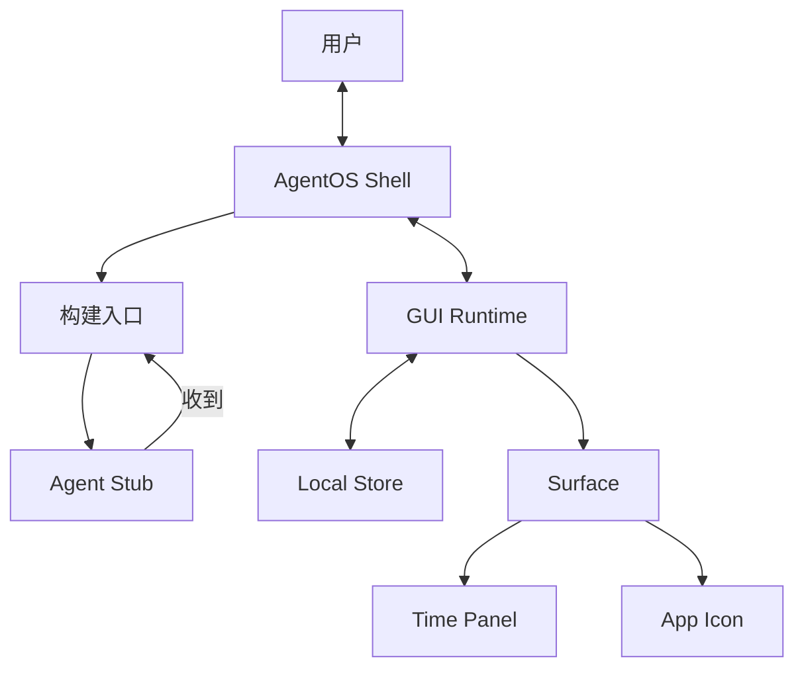
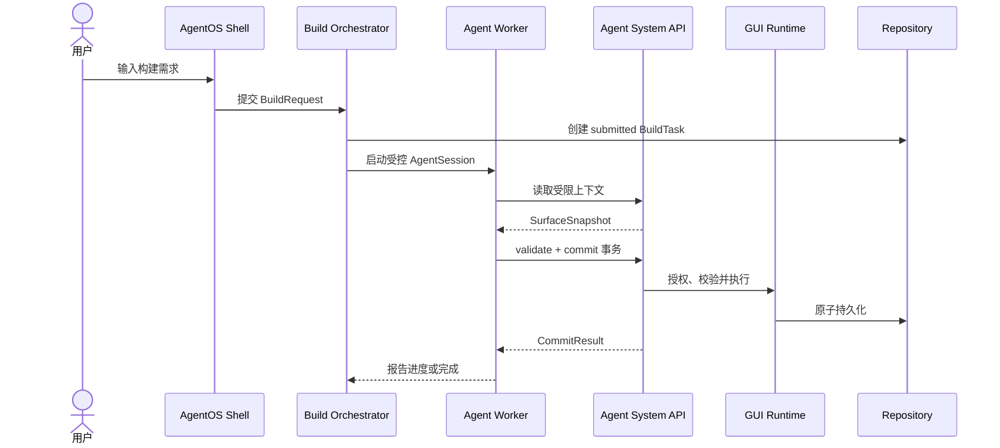
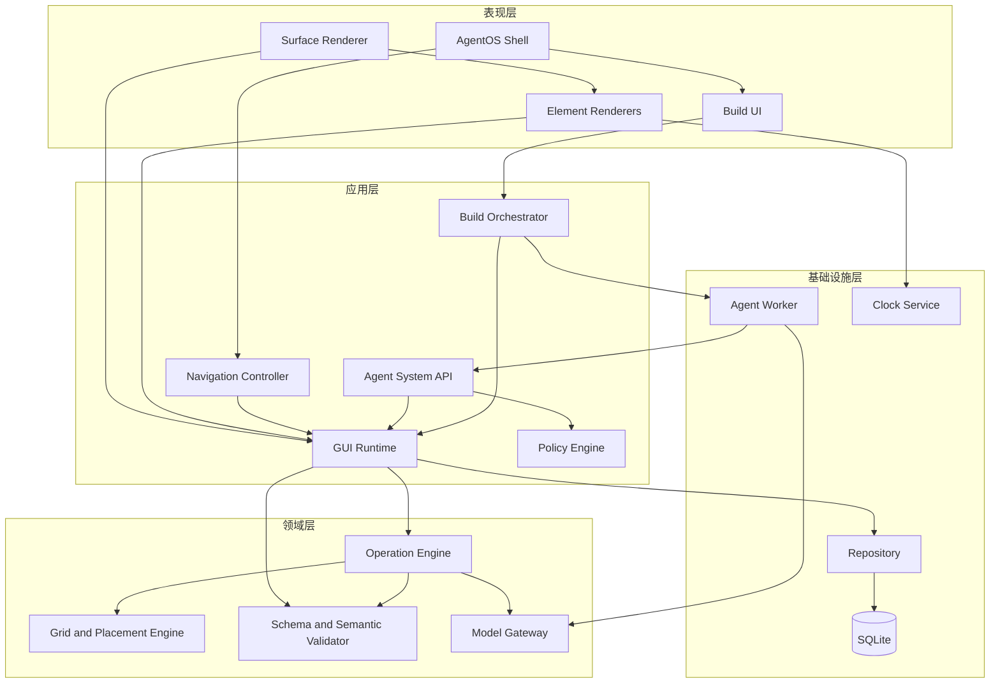
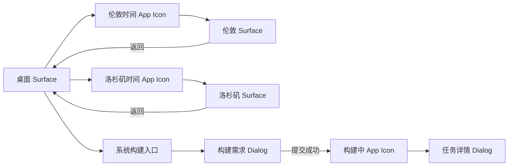
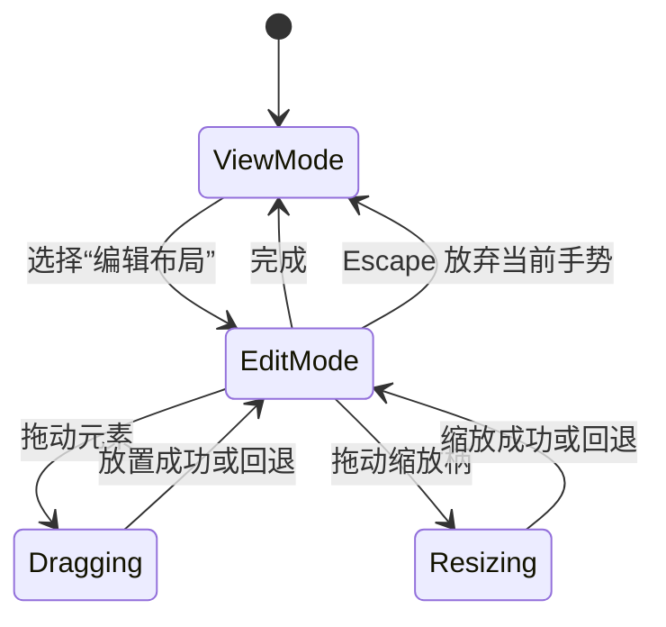
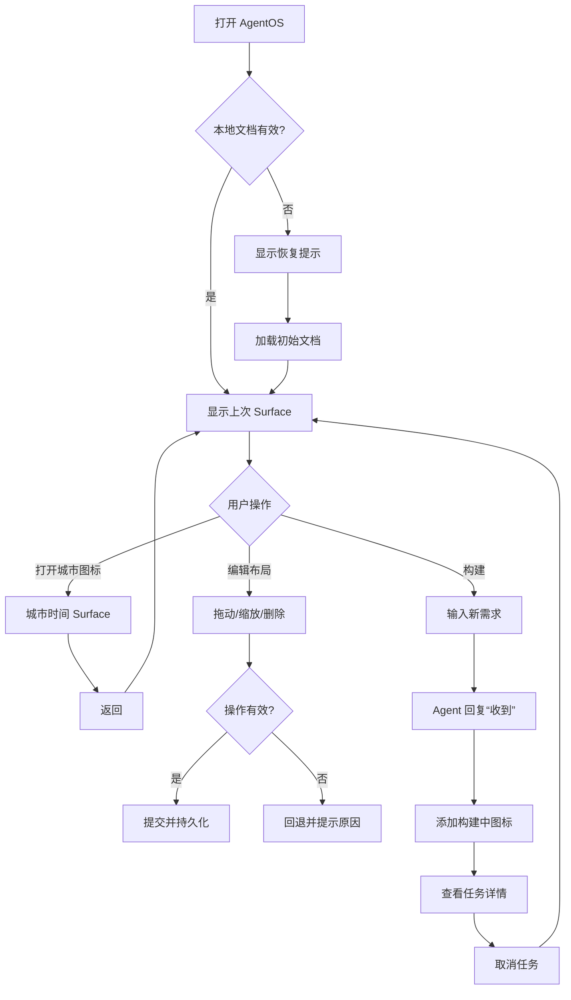

# AgentOS MVP 设计文档

- 文档状态：Draft v0.1
- 日期：2026-10-08
- MVP 主题：二维可扩展 GUI 与 Agent 构建入口

## 1. 背景与目标

AgentOS 希望建立一种不同于传统固定应用的交互模式：人类使用稳定、确定性的 GUI；当现有 GUI 无法满足需求时，人类通过系统级构建入口向 Agent 提出需求，Agent 再扩展当前界面或创建新的应用。

本 MVP 不实现真正的应用生成，只验证以下闭环：

1. 系统可以用通用协议描述二维桌面。
2. 桌面可以显示确定性运行的 GUI 元素。
3. App Icon 可以连接不同 Surface，形成类似 Wiki 的可扩展结构。
4. 用户可以在当前上下文中提出构建需求。
5. Agent 回复“收到”，系统显示可管理的“构建中”入口。

MVP 提供：

- 一个二维桌面；
- 一个显示设备当地时间的 Time Panel；
- 伦敦时间和洛杉矶时间两个 App Icon；
- 点击 App Icon 进入对应的二维界面；
- 元素的添加、移除、移动和缩放；
- 一个系统级 Agent 构建入口；
- 用户提交需求后 Agent 固定回复“收到”；
- 当前 Surface 出现“构建中”的 App Icon；
- App Icon 可以启动用户明确注册的本地应用，并在该应用退出后恢复发起 Surface；
- 界面结构和任务状态保存在本地。

核心验证目标是：

> Runtime 只理解通用 Surface、Element 和 Operation；新增入口和界面不需要修改 Runtime。

## 2. 示例场景

初始桌面包含一个当地时间 Time Panel，以及伦敦、洛杉矶两个 App Icon。

```text
桌面
├── 当地时间 Time Panel
├── 伦敦时间 App Icon
└── 洛杉矶时间 App Icon
```

点击城市图标，进入包含对应城市 Time Panel 的 Surface。

用户随后点击“构建”，输入：

> 在当地时间 Panel 上增加当地天气。

MVP 执行：

1. 创建 BuildTask；
2. Agent 返回“收到”；
3. BuildTask 状态变为 `building`；
4. 当前 Surface 添加“当地天气 · 构建中”App Icon；
5. 用户可以查看需求或取消构建。

MVP 不实际实现天气能力。

## 3. 设计原则

### 3.1 运行与构建分离

Time Panel 由本地确定性程序持续更新，不调用 Agent。Agent 仅在用户主动提交构建需求时参与。

### 3.2 GUI 数据与渲染器分离

GUI 通过结构化数据描述。Runtime 解释协议，不包含伦敦、洛杉矶或天气等具体业务规则。

### 3.3 二维空间是一等对象

每个界面都是一个 Surface。元素使用逻辑网格定位，不直接保存屏幕像素。

### 3.4 主树组织，链接跳转

Surface 以一棵主树组织，每个非根 Surface 只有一个父 Surface，因此始终拥有唯一的树路径。App Icon 可以链接到树中任意 Surface；链接只提供跳转，不改变目标节点的父子关系。跳转后，Shell 将当前位置更新为目标 Surface 在主树中的真实位置。

### 3.5 构建任务持久可见

用户提交需求后，系统立即创建持久任务和可见占位图标。构建任务不能只存在于聊天消息中。

## 4. 系统结构



### AgentOS Shell

- 显示当前 Surface 标题；
- 在顶部显示从根 Surface 到当前 Surface 的唯一树路径；
- 返回上一个 Surface；
- 在当前 Surface 内嵌可点击展开的文本导航对话框；
- 打开构建入口；
- 展示构建任务详情；
- 管理 Surface 导航历史。

### GUI Runtime

- 加载 GUI 文档；
- 渲染 Surface 和两种 GUI 元素；
- 执行二维操作；
- 进行边界和碰撞校验；
- 保存和恢复状态；
- 对未知元素安全降级。

### Agent Stub

MVP 中 Agent 只返回固定结果：

```json
{ "message": "收到" }
```

### Repository 与 SQLite

第一版使用 Rust Repository 层和 SQLite 保存 Surface、元素、BuildTask、操作历史与系统设置。React、Agent Worker 和 Agent System API 都不能直接访问数据库；领域变更只能通过 Runtime 与 Operation Engine 持久化。

## 5. GUI 描述协议

```ts
interface GUIDocument {
  version: 1;
  rootSurfaceId: string;
  surfaces: Surface[];
  buildTasks: BuildTask[];
}

interface Surface {
  id: string;
  title: string;
  icon: SurfaceIcon;
  parentSurfaceId?: string;
  width: number;
  height: number;
  elements: GUIElement[];
}

interface SurfaceIcon {
  name: string;
  color: string;
}

interface Rect {
  x: number;
  y: number;
  width: number;
  height: number;
}

interface BaseElement {
  id: string;
  rect: Rect;
  zIndex: number;
}

type GUIElement = TimePanel | AppIcon;
```

MVP 默认使用 12 列逻辑网格。坐标以左上角为原点，所有元素必须位于 Surface 边界内且尺寸为正数。

### Time Panel

```ts
interface TimePanel extends BaseElement {
  type: "timePanel";
  title: string;
  timeZone?: string;
  format: "12-hour" | "24-hour";
  showDate: boolean;
  showSeconds: boolean;
}
```

`timeZone` 为空时使用设备当地时区。城市必须使用 IANA 时区名称，例如 `Europe/London` 和 `America/Los_Angeles`，不能保存固定 UTC 偏移量。

### App Icon

```ts
type AppIconTarget =
  | { kind: "surface"; surfaceId: string }
  | { kind: "localApp"; localAppId: string };

interface AppIcon extends BaseElement {
  type: "appIcon";
  title: string;
  status: "ready" | "building" | "failed";
  target?: AppIconTarget;
  buildTaskId?: string;
}

interface LocalAppDefinition {
  id: string;
  name: string;
  executablePath: string;
  arguments: string[];
  workingDirectory?: string;
  iconPath?: string;
  enabled: boolean;
}

interface ExternalAppSession {
  id: string;
  localAppId: string;
  returnSurfaceId: string;
  launcherElementId: string;
  processId: number;
  status: "launching" | "running" | "exited" | "failed";
  startedAt: string;
  exitedAt?: string;
}
```

- `ready` 状态必须提供有效的 `target`；
- `building` 和 `failed` 状态必须提供有效的 `buildTaskId`；
- `surface` target 在 AgentOS 内打开目标 Surface；
- `localApp` target 通过受控 Native Host 启动本地应用；
- 点击任务图标打开任务详情。

每个 Surface 必须指定 `icon`。根 Surface 不提供 `parentSurfaceId`，其他 Surface 必须指向唯一父 Surface，且父链不能成环。当 App Icon 的 target 为 `surface` 时，Renderer 必须从目标 Surface 读取图标，入口自身不保存图标副本。因此同一个 Surface 出现在父节点或跨树链接中时始终使用一致图标；修改 `Surface.icon` 后所有入口同步更新。`localApp` target 使用 `LocalAppDefinition.iconPath`，没有图标文件时使用系统回退图标；构建任务入口使用由状态决定的系统图标。

```ts
function resolveAppIcon(document: GUIDocument, appIcon: AppIcon): SurfaceIcon {
  if (appIcon.target?.kind === "surface") {
    return getSurface(document, appIcon.target.surfaceId).icon;
  }

  return resolveNonSurfaceIcon(document, appIcon);
}
```

时间 Surface 继续作为内部 target 存在，本地 App 不替代它。两类入口使用相同的 App Icon 外观和二维操作，但打开行为不同：

```ts
const londonTimeIcon: AppIcon = {
  id: "london-icon",
  type: "appIcon",
  title: "伦敦时间",
  status: "ready",
  target: { kind: "surface", surfaceId: "london-time" },
  rect: { x: 1, y: 5, width: 1, height: 1 },
  zIndex: 1,
};

const vscodeIcon: AppIcon = {
  id: "vscode-icon",
  type: "appIcon",
  title: "VS Code",
  status: "ready",
  target: { kind: "localApp", localAppId: "local.vscode" },
  rect: { x: 3, y: 5, width: 1, height: 1 },
  zIndex: 1,
};
```

- 伦敦与洛杉矶图标进入 AgentOS 内部时间 Surface，并使用 Shell 返回栈；
- VS Code 图标启动外部程序，退出后使用 `ExternalAppSession.returnSurfaceId` 恢复上下文。

## 6. 二维操作协议

```ts
type GUIOperation =
  | { type: "addElement"; surfaceId: string; element: GUIElement }
  | { type: "removeElement"; surfaceId: string; elementId: string }
  | {
  type: "repositionElement";
      surfaceId: string;
      elementId: string;
      position: { x: number; y: number };
    }
  | {
      type: "resizeElement";
      surfaceId: string;
      elementId: string;
      size: { width: number; height: number };
    }
  | { type: "createSurface"; surface: Surface }
  | { type: "deleteSurface"; surfaceId: string }
  | {
      type: "copyApp";
      sourceAppSurfaceId: string;
      targetSurfaceId: string;
      newAppTitle: string;
      dataMode: "copy" | "empty";
      position?: { x: number; y: number };
    }
  | {
      type: "moveAppEntry";
      appSurfaceId: string;
      sourceSurfaceId: string;
      sourceElementId: string;
      targetSurfaceId: string;
      position?: { x: number; y: number };
    };

interface OperationTransaction {
  id: string;
  operations: GUIOperation[];
}
```

规则：

- MVP 中一个 App 对应一个可被 App Icon 指向的 Surface；
- `repositionElement` 只调整元素在同一 Surface 内的二维坐标，不改变 App 之间的关系；
- `copyApp` 根据当前 App 创建具有新 App ID 和新 Surface ID 的独立 App，并在目标 App 中创建指向新 App 的入口；
- `copyApp` 将源 Surface 的 `icon` 值复制到新 Surface；复制后两者可独立修改，入口分别跟随各自目标 Surface；
- `dataMode: "copy"` 克隆源 App 的 Surface、普通元素和本地数据；`dataMode: "empty"` 克隆界面、配置和数据 Schema，但使用默认空数据初始化新 App；
- 两种模式都为新 App、Surface、元素及新数据记录生成新 ID；复制完成后修改任一 App 不影响另一个；
- 源 App 内指向其他 App 的 ready App Icon 仍指向原来的外部 App，不递归复制整个 App 图；building/failed App Icon 和 BuildTask 不进入副本；
- `moveAppEntry` 先在目标 App 中创建入口，再移除 `sourceElementId` 表示的来源入口，两个步骤必须在同一事务内完成；
- `moveAppEntry` 不复制或修改图标；迁移后的入口继续从同一个目标 Surface 读取 `icon`；
- Copy 后系统中存在两个独立 App，源 App 及其入口保持不变；Move 后仍是同一个 App，其 ID、Surface、内部元素和数据保持不变；
- 用户必须从可访问的 App 列表中选择目标 App；MVP 不允许将 App 放入自身，也不允许移动根桌面；
- 如果来源入口已不存在、目标 App 不存在或目标 App 没有可放置位置，整个操作失败；
- 移除 App Icon 只移除入口，不自动删除目标 Surface；
- 删除仍被引用的 Surface 时拒绝操作；
- 创建 Surface 和入口图标时使用原子事务；
- 事务中任一操作失败时不提交任何操作。

## 7. 构建入口

构建入口属于 AgentOS Shell，不是 Surface 内的第三种 GUI 元素。

```ts
interface BuildTask {
  id: string;
  surfaceId: string;
  request: string;
  title: string;
  status:
    | "submitted"
    | "building"
    | "completed"
    | "failed"
    | "cancelled";
  agentMessage: string;
  placeholderElementId: string;
  createdAt: string;
  updatedAt: string;
}

interface BuildRequest {
  surfaceId: string;
  request: string;
  placeholder: {
    title: string;
    position?: { x: number; y: number };
  };
}
```

### 提交流程



用户未指定位置时，Runtime 从左到右、从上到下寻找第一个可用网格；没有空间时扩展 Surface 高度。

取消构建时，将任务改为 `cancelled`，移除占位图标并保留任务历史。

## 8. 校验与错误处理

Runtime 在应用操作前校验：

- Surface 和 Element ID 唯一；
- 每个 Surface 都有受支持的 icon name 和有效颜色；
- 除根 Surface 外每个 Surface 都有唯一且有效的 `parentSurfaceId`，父链无环并最终到达根 Surface；
- Surface、任务和图标引用有效；
- 元素位于边界内且尺寸为正；
- Time Panel 使用有效 IANA 时区；
- ready App Icon 拥有有效的 Surface target 或已授权 Local App target；
- building App Icon 拥有 BuildTask。

错误处理：

- 未知元素显示“不支持的元素”，不导致 Surface 崩溃；
- 无效时区显示错误，不错误回退到本地时间；
- 状态解析失败时保留原始数据，并提供恢复初始状态操作；
- 构建请求失败时保留占位图标并标记为 `failed`；
- 本地应用路径失效、启动失败或不在授权注册表中时停留在当前 Surface，并显示可诊断错误；
- Native Host 只接受 `localAppId`，前端不能传入任意可执行文件路径或 Shell 命令。

## 9. 非功能要求

- Time Panel 每秒更新时不导致整个 Surface 重渲染；
- 刷新后恢复 GUI 文档和 BuildTask；
- 所有交互支持键盘操作；
- 图标和按钮具有可访问名称；
- 时间文本不溢出；
- 本地操作在 100 ms 内产生视觉反馈；
- MVP 不依赖后端服务即可运行，但需要桌面 Native Host 提供本地进程能力。

## 10. 非目标

- 真正生成天气 Panel；
- Agent 修改源代码或自动完成任务；
- 任意第三方插件和脚本执行；
- Tag、全文搜索和多人协作；
- 云同步和通用权限系统；本地 App 仅实现显式注册与逐项授权；
- 移动端响应式编排；
- 真实天气 API。

## 11. 验收标准

1. 根 Surface 显示持续更新的当地时间。
2. 桌面显示伦敦和洛杉矶 App Icon。
3. 点击图标打开正确的城市 Surface。
4. 城市时间使用 IANA 时区并正确处理夏令时。
5. 用户可以添加、移除、移动和缩放元素。
6. 非法操作不会破坏当前 GUI 文档。
7. 用户可以从任意 Surface 打开构建入口。
8. 提交天气需求后显示 Agent 回复“收到”。
9. 当前 Surface 出现“当地天气 · 构建中”App Icon。
10. 点击构建中图标可以查看原始需求和状态。
11. 取消任务会移除占位图标并保留任务历史。
12. 刷新后 Surface、元素和 BuildTask 保持不变。
13. 新增城市入口不需要修改 Runtime 源代码。
14. Copy 可以选择复制现有数据或创建空数据副本，两种结果都与原 App 独立。
15. 本地 App Icon 只能启动已授权应用，启动失败不会离开当前 Surface。
16. 由 AgentOS 启动的本地应用退出后，AgentOS 恢复并聚焦到启动前的 Surface。
17. 每个 Surface 可以指定图标，所有指向它的内部入口同步显示该图标且不能单独覆盖。
18. Copy 后的新 Surface 初始继承源图标，但后续修改任一 Surface 图标不会影响另一个。
19. 顶部路径始终显示当前 Surface 从根节点开始的唯一父链。
20. 通过链接或内嵌文本对话框跳转后，当前 Surface 和顶部路径更新为目标的真实树位置，链接来源不进入目标路径。

## 12. 实现阶段

### 阶段一：协议与静态渲染

- 定义 TypeScript 类型和示例 GUI 文档；
- 实现 Surface 与两种元素；
- 实现城市 Surface 导航。

### 阶段二：二维编辑

- 实现添加、移除、拖动和缩放；
- 实现网格吸附、边界和碰撞处理；
- 实现操作历史与撤销。

### 阶段三：构建入口

- 实现构建面板和 Agent Stub；
- 实现 BuildTask 和构建中 App Icon；
- 实现任务详情和取消。

### 阶段四：持久化与验收

- 接入 SQLite Repository 与 SQLx migrations；
- 增加协议校验；
- 完成单元测试和交互测试。

## 13. 后续演进

1. Agent 将自然语言转换为受控 GUI Operation；
2. BuildTask 完成后以事务替换占位图标；
3. 增加 Weather Panel；
4. 增加 Tag、搜索和多视图；
5. 增加版本、测试、回滚和权限；
6. 支持 Agent 构建更复杂的本地应用。

长期保持运行时与构建时分离：

$$
\text{稳定应用运行} \neq \text{持续调用 Agent}
$$

Agent 负责构建和演化，Runtime 负责确定性执行，人类控制需求提交、变更确认和任务取消。

## 14. 系统模块

MVP 是运行于 Ubuntu 24.04 的 Tauri 2 桌面应用。React 负责界面，Rust Host 负责 Agent API、本地能力和 SQLite 持久化。业务状态只能通过应用服务、Runtime API 和 Operation Engine 修改；UI 与 Agent 都不能直接写入持久化数据。



### 14.1 GUI Document Model

定义 `GUIDocument`、`Surface`、`TimePanel`、`AppIcon`、`BuildTask` 和 `GUIOperation`。该模块只包含类型、常量和纯数据，不依赖 React、浏览器 API 或存储实现。

职责：

- 提供所有领域对象的唯一类型定义；
- 提供初始 GUI 文档；
- 定义协议版本号；
- 为后续数据迁移保留版本边界。

### 14.2 Schema and Semantic Validator

负责两层校验：

- 结构校验：字段类型、必填字段、联合类型；
- 语义校验：ID 唯一、引用存在、矩形合法、时区有效、状态与引用匹配。

Validator 返回结构化错误，不抛出面向用户的文本：

```ts
interface ValidationIssue {
  code: string;
  path: string;
  message: string;
}
```

### 14.3 Operation Engine

系统中唯一可以修改 `GUIDocument` 的领域模块。输入旧文档和事务，返回新文档或错误；不就地修改旧对象。

职责：

- 执行添加、移除、调整位置、缩放、App 入口 Move、独立 App Copy 和 Surface 操作；
- 保证事务原子性；
- 调用 Validator 做提交前校验；
- 生成逆操作，支持撤销；
- 拒绝删除仍被引用的 Surface。

### 14.4 Grid and Placement Engine

负责二维几何规则，不负责渲染。

职责：

- 网格吸附；
- 边界判断；
- 矩形碰撞检测；
- 为新元素寻找首个可用位置；
- 必要时计算 Surface 新高度。

MVP 采用“禁止重叠”策略。调整位置或缩放导致碰撞时，操作失败并恢复原位置，不自动推挤其他元素。

### 14.5 GUI Runtime

应用层的统一入口，持有当前内存状态并协调领域模块。

职责：

- 启动时加载和校验文档；
- 暴露只读文档快照；
- 接收并执行 Operation Transaction；
- 维护 undo/redo 栈；
- 成功变更后触发持久化；
- 向 UI 发布状态更新。

### 14.6 Navigation Controller

管理 Surface 导航，不修改 GUI 文档。

```ts
interface NavigationState {
  currentSurfaceId: string;
  dialog: {
    surfaceId: string;
    expanded: boolean;
    draft: string;
    messages: Array<{
      role: "user" | "system";
      text: string;
    }>;
  };
}
```

顶部路径由 `currentSurfaceId` 沿 `parentSurfaceId` 反向计算到根 Surface，表示当前节点在主树中的唯一位置。跨节点 App Icon 是链接：点击后直接将 `currentSurfaceId` 更新为目标 Surface，展开目标的祖先节点，并重新计算顶部路径；不会把来源 Surface 留在目标路径中。

职责：

- 打开 App Icon 指向的 Surface；
- 维护当前 `surfaceId` 和返回栈；
- 将当前节点的父链渲染为顶部可点击面包屑；点击中间层级时将该树节点设为当前位置；
- 在当前 Surface 内容区域底部嵌入紧凑文本输入条，不使用遮罩或浮动模态框；
- 点击输入条的“展开”按钮后，在当前 Surface 内纵向展开文本会话；点击“收起”恢复为输入条；
- 接受 Surface 名称或路径文本；唯一匹配时跳转，多个匹配时在对话中返回可选路径，不猜测目标；
- 文本跳转成功后更新 `currentSurfaceId`，将对话框附着到新的当前 Surface，并以系统消息显示目标的真实树路径；
- 对话草稿、展开状态和消息属于 Shell 导航状态，不写入 `GUIDocument`，也不参与 App Copy；
- 拒绝进入不存在的 Surface；
- 页面刷新后恢复当前位置，失效时回到根 Surface。

导航对话框收起时是固定高度输入条，展开后高度不超过当前 Surface 可视区域的 `60%`，Surface 内容仍保持可见。键盘用户可通过“展开 / 收起”按钮切换；展开后焦点进入文本输入框，`Escape` 收起并将焦点还给输入条。

### 14.6A Local App Launch Coordinator

协调 Surface 上下文与 Native Host，不直接执行系统命令。

职责：

- 启动前记录 `returnSurfaceId` 和 `launcherElementId`；
- 仅以 `localAppId` 请求 Native Host 启动已授权应用；
- 创建并更新 `ExternalAppSession`；
- AgentOS 窗口在外部应用运行时保持后台，不销毁当前 Surface 状态；
- 收到进程退出事件后恢复并聚焦 AgentOS 窗口；
- 启动失败时恢复 Icon 状态并在当前 Surface 显示错误。

如果用户在外部应用运行期间已经回到 AgentOS 并导航到其他 Surface，退出事件只显示通知，不强制跳回旧 Surface。MVP 只保证跟踪由 AgentOS 新启动且可持续监控的进程；对于立即退出并转交给既有进程的 launcher，显示“无法跟踪关闭状态”，不伪造自动返回。

### 14.6B Native App Host

运行在 Tauri Rust 侧，负责本地应用注册、启动和进程生命周期事件。

安全规则：

- 用户通过系统文件选择器显式注册可执行文件；
- 注册结果生成稳定 `localAppId`，前端只保存该 ID；
- Rust Host 根据本地授权注册表解析真实路径，禁止前端传入 Shell 字符串；
- 参数以字符串数组传递，不经过 Shell 解释；
- 每次启动记录 PID，子进程退出后发送 `local-app-exited` 事件；
- 移除授权后，引用该应用的 Icon 显示“需要重新授权”。

### 14.7 Surface Renderer

将当前 Surface 映射为 12 列 CSS Grid，并按 `rect` 和 `zIndex` 放置元素。

职责：

- 将逻辑坐标转换成 CSS Grid 坐标；
- 把元素分发给对应 Renderer；
- 提供编辑模式下的选中框、拖动层和缩放柄；
- 对未知元素显示安全占位界面。

### 14.8 Element Registry and Renderers

Element Registry 维护 `element.type -> renderer` 映射。MVP 注册两个 Renderer：

- `TimePanelRenderer`：通过 Clock Service 显示时间；
- `AppIconRenderer`：根据状态打开 Surface、BuildTask 或已授权本地应用。

`AppIconRenderer` 遇到 localApp target 时调用 Local App Launch Coordinator，而不是 Navigation Controller。

新增元素类型时只需注册新的 Renderer，不修改 Surface Renderer。

### 14.9 Clock Service

封装系统时间和 `Intl.DateTimeFormat`，提供可测试的当前时间流。

职责：

- 每秒产生一次时间更新；
- 按 locale、IANA 时区和 12/24 小时制格式化；
- 检测无效时区；
- 测试时注入固定时钟。

### 14.10 Build UI

包含构建按钮、需求输入 Dialog 和任务详情 Dialog，只负责输入与展示。

职责：

- 收集用户需求；
- 显示 Agent 回复；
- 展示任务状态和原始需求；
- 发起取消任务命令；
- 管理 Dialog 的焦点与键盘关闭行为。

### 14.11 Build Orchestrator

协调 BuildTask、Agent Gateway 和 Operation Engine。

提交请求时：

1. 创建 `submitted` BuildTask；
2. 调用 Agent Gateway；
3. 收到“收到”后更新为 `building`；
4. 通过 Placement Engine 计算位置；
5. 通过 Operation Engine 添加 building App Icon；
6. 原子保存任务和 GUI 文档。

取消请求时，将任务标记为 `cancelled`，并通过 Operation Engine 移除占位图标。

### 14.12 Model Gateway

为模型提供商提供可替换的出站边界。MVP 可实现 `StubModelGateway`，始终返回：

```ts
{ message: "收到" }
```

后续可以增加远程模型或本地模型实现，但 Agent Worker 不应依赖具体模型 SDK。Model Gateway 只负责模型推理，不向模型暴露 Runtime、数据库或本地系统能力。

### 14.13 Agent System API

为 Agent Worker 提供受 capability 和 BuildTask scope 限制的系统能力。Agent 只能通过 JSON-RPC 读取领域快照、预检事务、提交 validation token、报告进度或请求用户确认。API 不暴露 SQL、Repository、文件系统、任意 Shell 或原始 Tauri command。

完整协议见 [AgentOS Agent System API](Agent-System-API.md)。

依赖方向固定为：

```text
Agent Worker
  -> Agent System API
  -> Policy / Application Services / Operation Engine
  -> Repository traits
  -> SQLite adapters
```

### 14.14 Repository

负责将领域对象和事务结果持久化到 SQLite，不包含权限或业务决策。

职责：

- 在数据库事务中读取和写入 GUI 文档；
- 保存最后访问的 Surface；
- 写入前生成上一版本备份；
- 数据损坏时返回可诊断错误，不静默覆盖。

Repository trait 定义在应用边界，SQLx adapter 位于基础设施层。Agent System API crate 不得依赖 SQLx，Agent Worker 不得链接 Repository crate。

### 14.15 Test Fixtures

提供固定时间、初始 GUI 文档和典型 Operation Transaction。测试夹具与生产代码分离，但作为系统模块维护，以保证协议示例与测试数据一致。

## 15. 每个模块的技术选型

### 15.1 总体技术栈

| 类别 | 选择 | 原因 |
| --- | --- | --- |
| 桌面容器 | Tauri 2 | 提供受控本地应用启动、进程退出事件和窗口重新聚焦能力 |
| 构建工具 | Vite | 启动快、配置少，适合纯前端 MVP |
| UI 框架 | React 19 + TypeScript | 适合声明式 Renderer 和可判别联合类型 |
| 包管理器 | pnpm | 支持 workspace、严格依赖和可复现 lockfile |
| 样式 | CSS Modules + CSS Custom Properties | 样式隔离，同时保留主题变量；不引入重型 UI 框架 |
| 图标 | Lucide React | 覆盖时钟、返回、构建、关闭等标准图标 |
| 数据校验 | Rust Serde + JSON Schema；前端 Zod | Rust 校验权威协议，前端提前反馈输入错误 |
| 状态管理 | Zustand | 轻量，支持 selector，避免时钟更新引发整页重渲染 |
| 不可变更新 | Immer | Operation Engine 可读地生成新文档和逆操作 |
| 拖动与缩放 | Pointer Events + 自有网格算法 | MVP 只需矩形网格，避免通用画布库带来的模型耦合 |
| 时间处理 | 原生 `Date` + `Intl.DateTimeFormat` | 原生支持 IANA 时区和夏令时，无需日期库 |
| ID | Rust `uuid` crate | ID 由权威服务生成，Agent 草案不能伪造数据库标识 |
| 持久化 | SQLite + SQLx migrations | 支持事务、revision、审计和可靠迁移 |
| Agent API | Rust + JSON-RPC 2.0 over stdio | 不开放 TCP 端口，以 capability session 暴露最小系统能力 |
| 异步运行时 | Tokio | 管理 Agent Worker、模型调用、事件和本地进程 |
| 单元测试 | Vitest | 与 Vite 集成，适合领域纯函数测试 |
| 组件测试 | React Testing Library | 从用户行为验证 Renderer 和 Dialog |
| 端到端测试 | Playwright | 验证导航、拖动、刷新恢复和构建流程 |
| 代码质量 | ESLint + Prettier | 统一 TypeScript 和样式格式 |

### 15.2 模块映射

| 模块 | 技术 | 关键实现方式 |
| --- | --- | --- |
| GUI Document Model | Rust domain types + 生成的 TypeScript DTO | Rust 是权威模型，前端使用生成类型 |
| Validator | Serde/JSON Schema + Rust 语义校验 | 检查结构、引用、树关系、权限和几何约束 |
| Operation Engine | Rust 纯领域服务 | 预检后原子提交，生成逆操作与影响摘要 |
| Grid and Placement | Rust 纯函数 | 矩形相交算法、网格扫描和边界计算 |
| GUI Runtime | Rust Runtime + Zustand 只读投影 | Rust 管理 revision 和写入，前端订阅快照与事件 |
| Navigation Controller | Zustand slice | `currentSurfaceId`、history stack 和 `goBack` |
| Surface Renderer | React + CSS Grid | `grid-column`、`grid-row` 映射逻辑 Rect |
| Element Registry | TypeScript `Map` | Renderer 注册表和未知类型 fallback |
| Time Panel | React + Clock Service | 组件局部订阅每秒 tick，使用 `Intl.DateTimeFormat` |
| App Icon | React + Lucide | 按 ready/building/failed 展示不同状态 |
| Build UI | React 原生 Dialog + CSS Modules | 模态焦点管理、表单校验和提交状态 |
| Build Orchestrator | Rust + Tokio | 创建 AgentSession，串联 Worker、确认、Runtime 与任务状态 |
| Model Gateway | Rust trait | MVP 使用 Stub，未来适配远程或本地模型 |
| Agent System API | Rust JSON-RPC handler | capability guard、DTO 映射、预检/提交、幂等与审计 |
| Repository | Rust traits + SQLx SQLite adapter | Agent API 只依赖应用服务，不依赖 SQLx adapter |
| Local App Coordinator | TypeScript + Tauri IPC | 保存返回上下文，订阅进程退出事件并恢复 Surface |
| Native App Host | Rust + Tauri commands/events | 管理授权注册表，以参数数组启动进程并监控 PID |
| Test Fixtures | TypeScript factory | 固定 ID 和固定时间，减少脆弱快照测试 |

### 15.3 暂不选择的技术

- 不使用 Electron：Tauri 的 Rust Host 更适合提供窄而明确的本地进程安全边界。
- 不启动通用 HTTP 后端：Agent API 使用受控子进程 stdio，桌面数据保存在本机 SQLite。
- 不使用 React Flow/Konva：它们偏图编辑或 Canvas，会增加可访问性和布局映射成本。
- 不使用 Tailwind：当前界面规模小，CSS Modules 更容易表达固定网格和组件状态。
- 不使用完整日期库：`Intl.DateTimeFormat` 已覆盖时区显示需求。
- 不接入真实模型 SDK：先稳定 Build Gateway 边界和任务交互。

### 15.4 未来替换路径

| MVP 实现 | 扩展条件 | 可替换方案 |
| --- | --- | --- |
| SQLite 单机 Repository | 需要跨设备同步 | 远程同步服务 + 本地 SQLite 缓存 |
| Stub Model Gateway | Agent API 稳定 | 远程模型 / 本地模型 |
| stdio Agent Worker | 需要远程执行 | mTLS gRPC/HTTP transport，保持同一 API DTO |
| 单 Runtime 实例 | 多文档并发编辑 | 文档仓库 + 独立 Runtime 实例 |
| 本地历史栈 | 需要跨设备或协作 | 事件日志 / CRDT |

## 16. UI 交互设计

### 16.1 信息架构



### 16.2 全局 Shell

```text
┌──────────────────────────────────────────────────────────────┐
│ [←]  AgentOS                         当前 Surface    [＋ 构建] │
├──────────────────────────────────────────────────────────────┤
│                                                              │
│                       Surface 画布                            │
│                                                              │
└──────────────────────────────────────────────────────────────┘
```

交互规则：

- 根 Surface 中返回按钮不可用且不占用焦点顺序；
- Surface 标题居中但不遮挡左右操作区；
- “构建”是 Shell 的主操作，在所有 Surface 保持同一位置；
- `Escape` 只关闭最上层 Dialog，不触发返回；
- 浏览器后退与 Shell 返回执行相同的 Surface 导航语义。

### 16.3 桌面 Surface

```text
┌──────────────────────────────────────────────────────────────┐
│      1       2       3       4       5       6  ...      12  │
│  ┌───────────────────────────────────┐                       │ 1
│  │ 当地时间                          │                       │
│  │                                   │                       │ 2
│  │ 21:36:08                          │                       │
│  │ 2026 年 10 月 8 日                │                       │ 3
│  └───────────────────────────────────┘                       │
│                                                              │ 4
│  ┌──────────┐    ┌──────────┐                                │
│  │   ◷      │    │   ◷      │                                │ 5
│  │ 伦敦时间 │    │洛杉矶时间│                                │
│  └──────────┘    └──────────┘                                │ 6
│                                                              │
└──────────────────────────────────────────────────────────────┘
```

交互规则：

- Time Panel 是信息展示，不接管点击导航；
- App Icon 单击选中，双击或按 `Enter` 打开；
- 选中状态显示清晰边框，不改变元素尺寸；
- 选中 ready App Icon 后，Shell 显示“移动”“复制”“删除”操作组；其他元素不显示 App 关系操作；
- 点击“移动”打开目标 App 选择器；确认后在目标 App 中放置当前 App 的入口，并移除当前来源入口；
- 点击“复制”先输入新 App 名称、选择目标 App，并选择“复制现有数据”或“使用空数据”；确认后创建独立副本并放置入口；
- “复制现有数据”克隆 Surface、元素和数据；“使用空数据”克隆界面、配置和 Schema，但以默认空数据启动；
- 两种 Copy 模式都会重建 ID，后续修改副本不会影响原 App；
- Move 只改变 App Icon 形成的入口关系，不迁移 App 的 Surface、内部元素和数据；
- 在编辑模式中拖动元素称为“调整位置”，只改变同一 Surface 内的二维坐标；
- 点击“删除”后必须展示元素名称和影响范围，用户确认后才执行删除；
- 编辑模式下元素可拖动，Time Panel 显示缩放柄；
- 删除元素必须先选中，再按 `Delete` 或使用上下文操作；
- MVP 不支持元素重叠。

#### Move/Copy 目标选择

```text
┌──────────────────────────────────────────────┐
│ 移动“伦敦时间”到                         × │
├──────────────────────────────────────────────┤
│ 选择目标 App                                 │
│                                              │
│ ○ 世界时钟                                   │
│ ○ 工作桌面                                   │
│ ○ 旅行计划                                   │
│                                              │
│ 移动只改变入口位置，不迁移 App 数据。         │
│                              [取消] [移动]    │
└──────────────────────────────────────────────┘
```

Copy 使用扩展后的目标选择器：用户还需填写新 App 名称，确认按钮显示“创建副本”，说明文字为“将创建独立 App，原 App 保持不变”。目标列表排除当前 App；根桌面不提供 Move 操作。

```text
┌──────────────────────────────────────────────┐
│ 复制“伦敦时间”                           × │
├──────────────────────────────────────────────┤
│ 新 App 名称                                  │
│ [伦敦时间副本____________________________]  │
│                                              │
│ 放置到                                       │
│ ● 世界时钟                                   │
│ ○ 工作桌面                                   │
│                                              │
│ 数据                                         │
│ ● 复制现有数据    ○ 使用空数据               │
│                                              │
│ 两种模式都会生成全新的 App 与元素 ID。        │
│                        [取消] [创建副本]      │
└──────────────────────────────────────────────┘
```

### 16.4 城市时间 Surface

```text
┌──────────────────────────────────────────────────────────────┐
│ [←]  AgentOS                           伦敦时间      [＋ 构建] │
├──────────────────────────────────────────────────────────────┤
│                                                              │
│              ┌──────────────────────────────┐                │
│              │ 伦敦                         │                │
│              │                              │                │
│              │ 14:36:08                     │                │
│              │ 2026 年 10 月 8 日           │                │
│              │ Europe/London                │                │
│              └──────────────────────────────┘                │
│                                                              │
└──────────────────────────────────────────────────────────────┘
```

交互规则：

- 返回后恢复桌面原滚动位置和选中状态；
- 城市名、当前时间、日期和时区按信息层级显示；
- 时区无效时 Panel 原位显示错误，不用当地时间伪装成功。

### 16.4A 本地 App 入口

```text
AgentOS Surface
┌──────────────┐      启动       ┌────────────────────┐
│  VS Code     │ ─────────────→ │ 本地 VS Code 窗口  │
│  本地应用 ↗  │                 │                    │
└──────────────┘                 └─────────┬──────────┘
  ↑                                  │ 退出
  └──────── 恢复原 Surface 并聚焦 ───┘
```

交互规则：

- 本地 App Icon 带有“本地应用”副标签和外部启动标记；
- 首次配置必须通过系统文件选择器注册并确认授权，Agent 不能自行填写可执行路径；
- 点击后 Icon 显示“正在启动”，成功后 AgentOS 保持原 Surface 状态并退到后台；
- 外部进程退出后 AgentOS 窗口恢复到前台，当前 Surface、滚动位置和选中状态不变；
- 用户主动切回 AgentOS 时可以继续操作，外部应用退出事件仍会结束 session；
- 如果用户已导航到其他 Surface，退出时只显示“本地应用已关闭”的通知，不强制跳回旧 Surface；
- 启动失败时 Icon 恢复 ready 状态，并提供“重新授权”操作。

### 16.5 构建需求 Dialog

```text
         ┌────────────────────────────────────────┐
         │ 构建新功能                         [×] │
         ├────────────────────────────────────────┤
         │ 描述你希望在当前界面增加的能力          │
         │                                        │
         │ ┌────────────────────────────────────┐ │
         │ │ 在当地时间 Panel 上增加当地天气    │ │
         │ │                                    │ │
         │ └────────────────────────────────────┘ │
         │ 当前上下文：桌面                       │
         │                                        │
         │                 [取消] [开始构建 →]     │
         └────────────────────────────────────────┘
```

状态：

- `idle`：输入框自动聚焦，“开始构建”在空输入时禁用；
- `submitting`：按钮显示提交状态，输入保持可读但不可编辑；
- `acknowledged`：显示“Agent：收到”，短暂确认后关闭 Dialog；
- `error`：保留输入并显示重试操作。

提交成功后焦点移动到新建的构建中 App Icon，屏幕阅读器播报“当地天气，构建中”。

### 16.6 构建中图标

```text
┌──────────────┐
│      ◌       │
│   当地天气   │
│    构建中    │
└──────────────┘
```

交互规则：

- 加载动画只改变图形，不改变布局尺寸；
- 单击选中，双击或 `Enter` 打开任务详情；
- 构建中图标没有 `target`，不能误导航到空 Surface 或启动本地应用；
- failed 状态改用错误图标和“构建失败”文本。

### 16.7 构建任务详情 Dialog

```text
         ┌────────────────────────────────────────┐
         │ 当地天气                    构建中  [×] │
         ├────────────────────────────────────────┤
         │ 需求                                   │
         │ 在当地时间 Panel 上增加当地天气        │
         │                                        │
         │ Agent                                  │
         │ 收到                                   │
         │                                        │
         │ 创建于 2026-10-08 21:36                │
         │                                        │
         │                          [取消构建]     │
         └────────────────────────────────────────┘
```

取消构建需要二次确认。确认后 Dialog 关闭、占位图标消失、焦点回到“构建”按钮，任务历史保留为 `cancelled`。

### 16.8 编辑模式

查看和编辑必须显式区分，避免用户正常打开 App 时误移动元素。



MVP 中操作成功后立即保存，不额外提供整页“保存”按钮。撤销与重做位于编辑模式工具栏。

### 16.9 关键用户流程



### 16.10 视觉方向

- 产品形态是工作桌面，不做营销型首屏；
- 背景使用低对比度网格，帮助理解二维位置；
- Time Panel 采用高信息密度的工具面板样式；
- App Icon 保持固定点击区域，标签最多两行；
- 使用中性色作为基础，绿色表示 ready，琥珀色表示 building，红色表示 failed；
- 卡片圆角不超过 8 px；
- 所有动态状态同时使用图标和文字，不能只依赖颜色。

### 16.11 响应式边界

MVP 优先支持宽度不小于 1024 px 的桌面浏览器。较窄视口只提供可滚动的固定逻辑画布，不重新排列元素，确保 Agent 创建的二维关系保持稳定。移动端自适应编排留到协议增加断点布局之后。