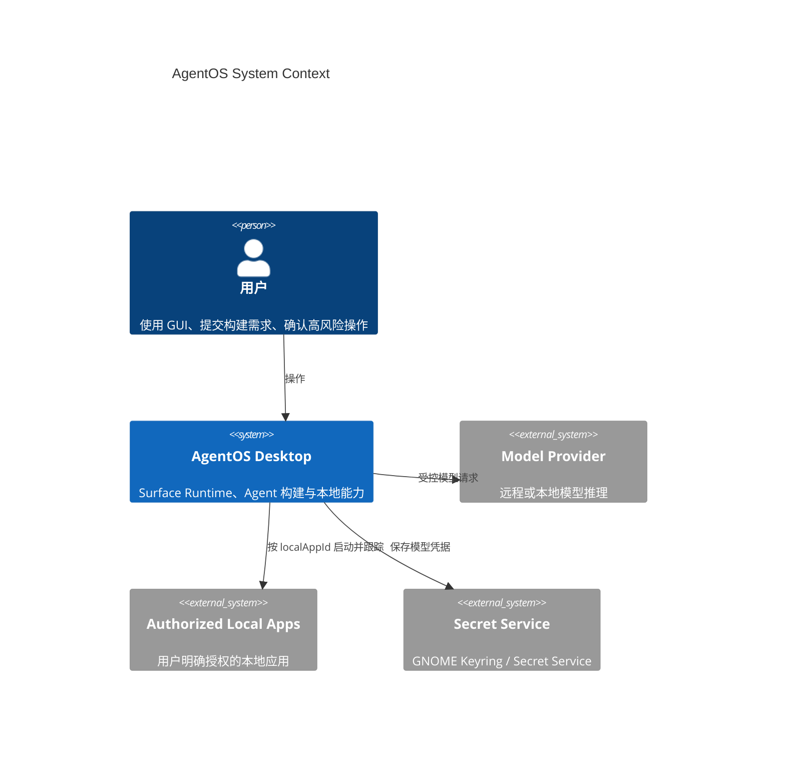
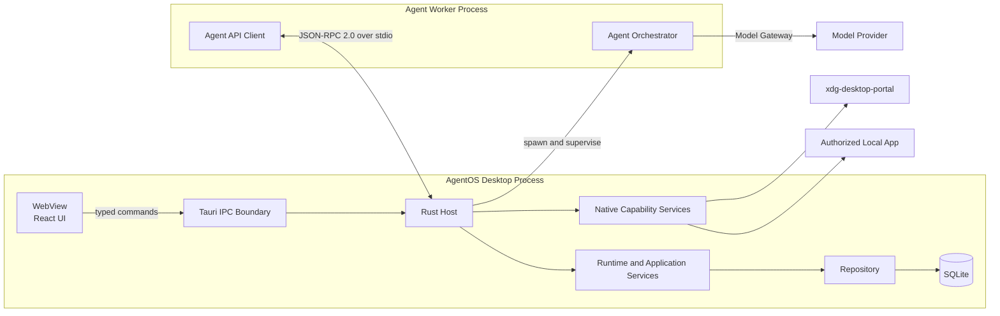
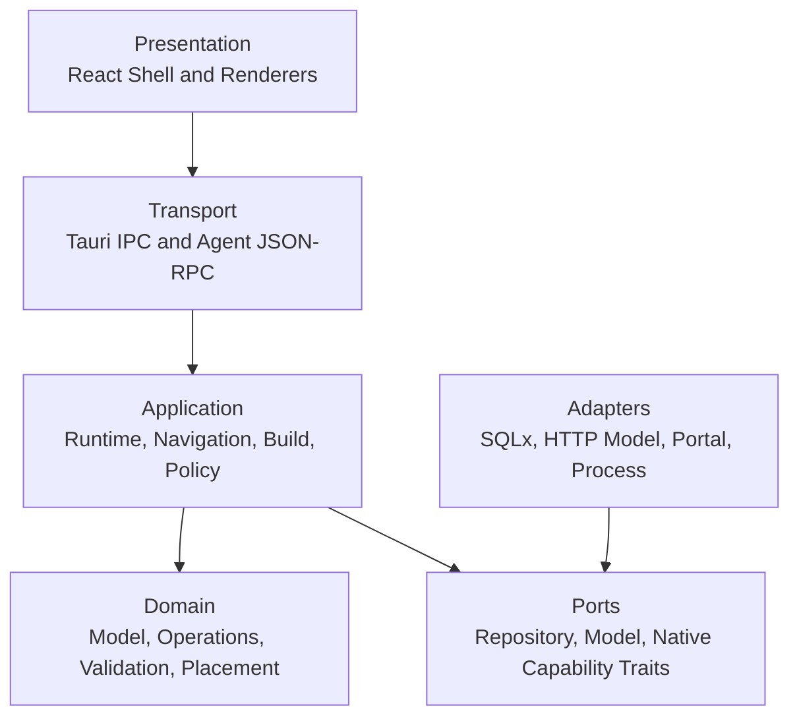
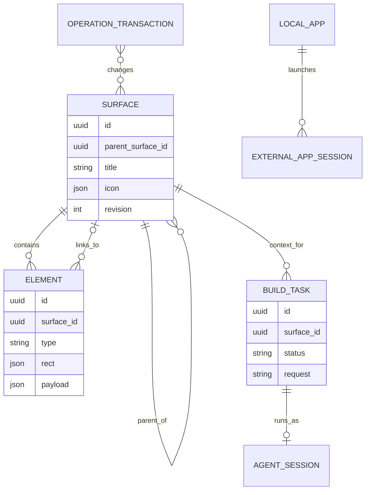
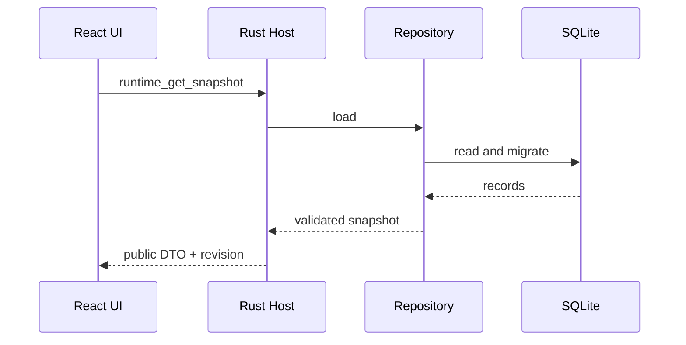
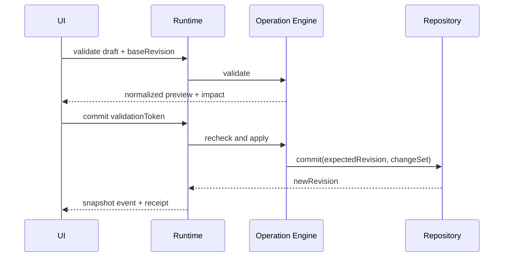
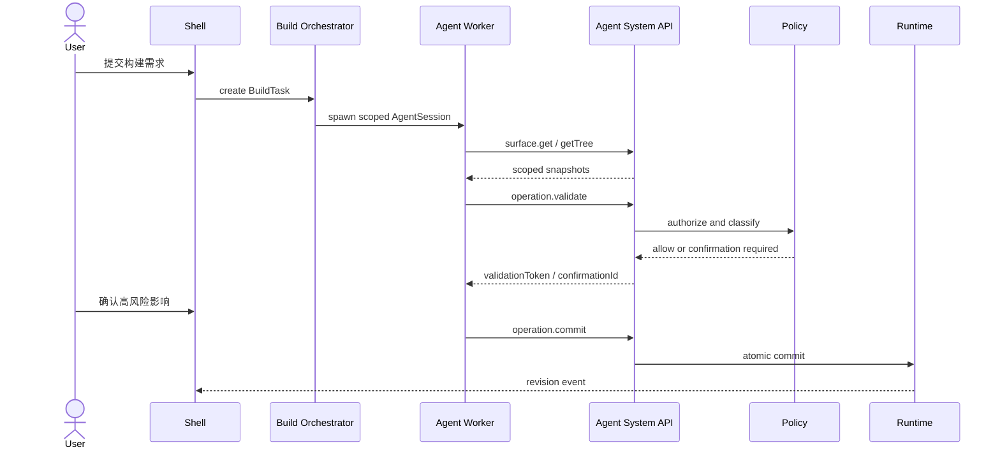
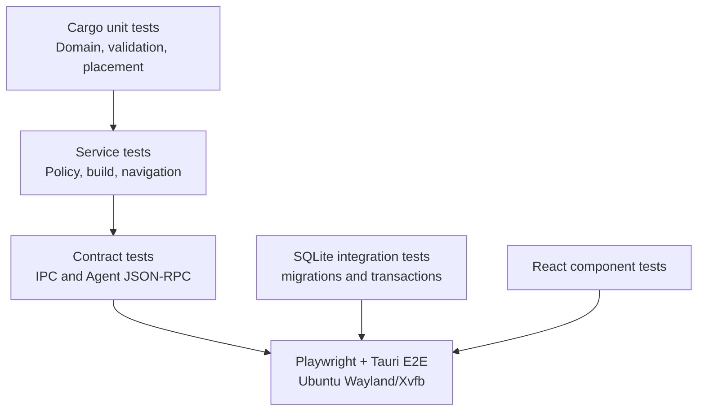

# AgentOS 总体架构

- 文档状态：Architecture Baseline v0.1
- 目标平台：Ubuntu 24.04 LTS，GNOME/Wayland 优先
- 产品形态：Tauri 2 单机桌面应用
- 核心原则：稳定 Runtime 确定性执行，Agent 通过受控 API 构建和演化应用

## 1. 架构目标

AgentOS 允许用户在二维 Surface 中使用持久 GUI，并通过 Agent 创建或修改 Surface、Panel、入口和应用数据。系统需要同时满足：

1. 没有 Agent 在线时，已构建应用仍可稳定运行。
2. UI、Agent 和外部程序都不能绕过领域规则直接修改持久化数据。
3. Agent 只能使用显式授权的系统能力，不能直接访问数据库、文件系统或任意 Shell。
4. 所有变更可预检、确认、审计、原子提交和撤销。
5. Surface 以主树组织，通过链接跨节点跳转；当前位置始终映射到唯一树路径。
6. 桌面能力在 Ubuntu 24.04 的 Wayland 环境中采用可验证、可降级的实现。
7. MVP 保持单机和模块化单体，不提前引入分布式系统复杂度。

## 2. 系统上下文



AgentOS 不接受远程入站连接。MVP 中模型提供商是唯一可选网络依赖；关闭模型能力后，Runtime、导航、持久化和本地应用入口仍可使用。

## 3. 进程架构



### 3.1 WebView

React WebView 只负责展示、输入和瞬时交互状态：

- AgentOS Shell、顶部树路径和内嵌文本导航；
- Surface 与 Element Renderer；
- 选择、拖动和缩放预览；
- BuildTask、确认和错误界面；
- 订阅 Rust Host 发布的快照与事件。

WebView 不持有权威 `GUIDocument`，不执行 SQL，不直接启动进程。所有领域写入通过类型化 Tauri command 进入 Rust 应用层。

### 3.2 Rust Host

Rust Host 是本机信任边界：

- 托管 Runtime、Operation Engine、Policy Engine 和 Repository；
- 校验所有来自 WebView 与 Agent Worker 的请求；
- 管理 SQLite transaction、revision、审计和撤销；
- 启动并监督 Agent Worker 与本地应用；
- 集成 Secret Service、文件选择器和桌面通知；
- 将领域事件发布给 WebView。

### 3.3 Agent Worker

每个活动 BuildTask 使用独立、短生命周期 Worker 或受控 Worker 会话。Worker：

- 通过 Model Gateway 调用模型；
- 只通过 Agent System API 获取系统上下文和提交变更；
- 不链接 Repository、SQLx 或 Tauri command；
- 任务取消、会话过期或 Host 退出时立即终止；
- 后续可在 bubblewrap 沙箱中运行，但 MVP 不允许任意代码执行。

## 4. 分层与依赖规则



强制规则：

- Domain 不依赖 React、Tauri、SQLx、Tokio 或模型 SDK。
- Application 只依赖 Domain 与 trait ports。
- Transport 只做认证、DTO 转换、限流和错误映射，不包含业务规则。
- SQLx、HTTP、Secret Service 和进程实现位于 adapters。
- React 不能导入数据库实体；只使用生成的公共 DTO。
- Agent API crate 不得依赖 SQLx、SQLite adapter 或原始 Tauri command。

依赖约束通过 Cargo workspace 分包和架构测试执行，而不是只依赖代码评审。

## 5. 模块划分

| 模块 | 所有权 | 主要职责 |
| --- | --- | --- |
| Shell | React | 窗口框架、顶部路径、工具栏、Dialog、通知 |
| Surface Renderer | React | 12 列网格、Element 分发、选择与编辑预览 |
| UI Projection Store | Zustand | Rust 快照的只读投影和瞬时 UI 状态 |
| IPC Client | TypeScript | 类型化 Tauri commands 和事件订阅 |
| GUI Domain | Rust | Surface、Element、BuildTask、Operation 等领域类型 |
| Operation Engine | Rust | 预检、原子变更、逆操作和影响摘要 |
| Validator | Rust | Schema、引用、树、几何和状态校验 |
| Placement Engine | Rust | 网格吸附、碰撞、自动放置和扩展高度 |
| Navigation Service | Rust | 父链路径、链接跳转、历史和路径解析 |
| Build Orchestrator | Rust/Tokio | BuildTask、AgentSession、Worker、确认和取消 |
| Agent System API | Rust | capability、scope、查询、预检、提交和审计 |
| Model Gateway | Rust trait | Stub、远程模型或本地模型适配 |
| Native Capability Service | Rust | 本地应用、portal、通知和 Secret Service |
| Repository | Rust traits | 领域对象、Unit of Work 和 revision ports |
| SQLite Adapter | SQLx | Schema migration、事务与领域对象映射 |
| Observability | tracing | 结构化日志、correlation ID、诊断导出 |

## 6. 权威状态与状态边界

系统状态分为四类：

### 6.1 持久领域状态

由 Rust Runtime 与 SQLite 管理：

- Surface 主树、图标和尺寸；
- Element、位置、配置和链接；
- App 数据与 Schema；
- BuildTask 和确认结果；
- LocalAppDefinition 与授权状态；
- Operation history、revision 和 audit metadata。

### 6.2 Shell 持久偏好

- 最后访问的 Surface；
- 窗口尺寸和主题；
- 文本导航展开偏好；
- 非敏感显示设置。

这些数据可存入 SQLite settings，但不属于 `GUIDocument`，不参与 App Copy。

### 6.3 UI 瞬时状态

只存在于 WebView：

- 当前选中元素；
- drag/resize preview；
- hover、focus 和打开的菜单；
- 未提交表单输入。

### 6.4 Secret

模型 API Key、token 等只进入 Linux Secret Service。SQLite 只保存 secret reference，不保存明文凭据。

## 7. 核心领域模型



关键不变量：

1. 根 Surface 没有 parent；其他 Surface 恰有一个有效 parent。
2. parent 链无环并最终到达根 Surface。
3. App Icon 链接不改变目标 Surface 的 parent。
4. Surface icon 是其所有内部入口图标的单一数据源。
5. Element Rect 必须为正、位于 Surface 边界内且不重叠。
6. 所有 ready App Icon 必须有有效 target。
7. 领域写入必须属于带 base revision 的 OperationTransaction。

## 8. 公共接口边界

### 8.1 WebView IPC

WebView 使用窄 Tauri command 集合：

```text
runtime_get_snapshot
runtime_validate_transaction
runtime_commit_transaction
navigation_open_surface
navigation_resolve_path
build_submit
build_cancel
confirmation_resolve
local_app_register_via_picker
local_app_launch
```

IPC command 接受公共 DTO，不接受 SQL、文件路径启动参数或数据库实体。所有 response 使用统一 envelope，包含 `requestId`、`revision` 和结构化错误。

### 8.2 Agent System API

Agent 通过 JSON-RPC 2.0 over stdio 使用：

- capability discovery 和任务上下文；
- Surface 快照、树和路径查询；
- `operation.validate` 与 `operation.commit`；
- progress、confirmation 和受控本地能力请求；
- revision change、cancel 和 confirmation 事件。

完整合约见 [Agent System API](Agent-System-API.md)。Agent 永远不能直接访问数据库。

### 8.3 Repository Port

Repository 是 Rust 应用层 port，不是 Agent API：

```rust
#[async_trait]
pub trait DocumentRepository: Send + Sync {
    async fn load(&self) -> Result<DocumentSnapshot, RepositoryError>;
    async fn commit(
        &self,
        expected_revision: Revision,
        change_set: ChangeSet,
    ) -> Result<CommitReceipt, RepositoryError>;
}
```

只有 SQLite adapter 实现该 trait。应用服务不能向上层泄漏 SQLx 类型。

## 9. 关键运行流程

### 9.1 启动与恢复



数据库 migration 在窗口进入可编辑状态前完成。加载失败时保留原文件，进入诊断恢复界面，禁止静默重建覆盖。

### 9.2 用户编辑



UI 不做权威碰撞或权限判断。前端可提供即时预览，但 Rust 结果决定是否提交。

### 9.3 Agent 构建



BuildTask 取消会撤销 session capability 并终止 Worker。旧 validation token 随 session 失效。

### 9.4 本地应用生命周期

1. 用户通过 portal 文件选择器注册应用。
2. Host 规范化并保存授权定义，前端只获得 `localAppId`。
3. 启动请求只携带 `localAppId` 和 return context。
4. Native Service 以参数数组启动，不经过 Shell。
5. 可跟踪进程退出时发布事件并恢复 AgentOS 上下文。
6. launcher 转交既有进程时明确降级为“无法跟踪关闭状态”。

## 10. 数据库架构

SQLite 由单个 Repository adapter 管理，启用：

```text
PRAGMA foreign_keys = ON
PRAGMA journal_mode = WAL
PRAGMA busy_timeout = 5000
```

建议表：

```text
schema_migrations
documents
surfaces
elements
build_tasks
operation_transactions
operation_events
local_apps
external_app_sessions
settings
audit_records
```

设计规则：

- JSON 只用于 element payload 等开放联合字段，树关系和外键保持结构化列。
- 每次领域提交更新 document revision，并在同一 SQLite transaction 写入 change set 与审计摘要。
- migration 只向前执行，升级前生成数据库备份。
- Agent API DTO 与表结构隔离，不向 Agent 返回 rowid、表名或内部列。
- MVP 单写者，多读者；写入由 Runtime 串行化，避免复杂锁协调。

## 11. 并发与一致性

- `revision` 提供乐观并发控制。
- validation token 绑定 session、draft hash、base revision 和过期时间。
- commit 前重新执行 capability、revision 和关键语义校验。
- idempotency key 防止 Agent 或 IPC 重试产生重复变更。
- OperationTransaction 全部成功或全部失败。
- 外部进程启动、模型调用等副作用不伪装成 SQLite 原子操作。
- 所有成功事务生成 inverse operations；不可逆动作必须单独确认。

## 12. 安全架构

### 12.1 信任级别

从高到低：

```text
Rust Domain and Policy
  > Application Services
  > React WebView
  > Agent Worker and Model Output
  > External Local Apps
```

模型输出始终视为不可信输入。

### 12.2 主要控制

- Tauri allowlist 只注册明确 command，不提供通用 invoke、Shell 或 fs 插件。
- AgentSession 使用短期 capability，不允许 grant、refresh 或 impersonate。
- Agent API 使用 stdio，不监听 TCP。
- 高风险操作展示对象、影响范围和可撤销性后由用户确认。
- Local App Host 只解析授权注册表中的 `localAppId`。
- Secret 进入 Secret Service，不进入日志、提示词或 SQLite。
- 日志与 API error 不包含 SQL、完整路径、token 或 backtrace。
- Content Security Policy 禁止任意远程脚本。
- 依赖锁定并在 CI 执行 Rust、npm 和许可证审计。

### 12.3 后续沙箱

当 Agent 获得代码生成或测试能力时，必须先引入独立 workspace capability，并使用 bubblewrap/container 隔离文件、网络与进程。不能把通用文件系统或 Shell 加入当前 Agent System API。

## 13. Ubuntu 24.04 集成

| 能力 | 首选实现 | 降级策略 |
| --- | --- | --- |
| WebView | WebKitGTK 4.1 / Tauri 2 | 启动诊断提示缺失依赖 |
| 文件选择 | xdg-desktop-portal | GTK picker adapter |
| Secret | freedesktop Secret Service | 禁用模型并提示配置 keyring |
| 通知 | Tauri notification / portal | 应用内通知中心 |
| 本地进程 | `tokio::process::Command` | 返回结构化启动错误 |
| 窗口聚焦 | Tauri + desktop capability | 显示通知，不承诺强制抢焦点 |
| 显示协议 | Wayland 优先 | X11 作为兼容测试，不依赖 X11 专有能力 |

系统不得依赖全局键盘钩子、任意窗口嵌入或 Wayland 不保证的窗口控制能力。

## 14. 可观测性

Rust 使用 `tracing` 输出结构化日志：

- `requestId`：一次 UI/Agent API 调用；
- `sessionId`：AgentSession；
- `buildTaskId`：构建任务；
- `transactionId`：领域事务；
- `auditId`：用户可引用的诊断标识。

默认日志滚动保存在应用数据目录，限制大小和保留期。用户可导出脱敏诊断包，内容包括版本、迁移状态、最近错误和系统依赖，不包括 Surface 私密内容、模型提示和 Secret。

## 15. 测试策略



必须覆盖：

- Surface 父链无环和链接跳转后路径更新；
- Operation 原子性、revision conflict、幂等和撤销；
- Agent capability deny、过期、取消和用户拒绝；
- Agent API crate 无 SQLx 依赖的架构测试；
- SQLite migration、备份和损坏恢复；
- 本地应用授权、启动失败、可跟踪退出和降级；
- WebView 不能绕过 Runtime 写入；
- 原型关键界面的视觉回归和键盘访问。

## 16. 仓库结构

```text
agentos/
├── apps/
│   └── desktop/
│       ├── src/                    # React Shell and renderers
│       └── src-tauri/              # Tauri bootstrap only
├── crates/
│   ├── agentos-domain/             # Pure domain model and operations
│   ├── agentos-application/        # Runtime, build, policy, navigation
│   ├── agentos-agent-api/          # JSON-RPC DTO and handlers
│   ├── agentos-agent-worker/       # Supervised worker executable
│   ├── agentos-repository/         # Repository traits
│   ├── agentos-sqlite/             # SQLx adapter and migrations
│   ├── agentos-native/             # Portal, process, secret adapters
│   └── agentos-contracts/          # Public DTO/schema generation
├── packages/
│   ├── ui/                         # Shared React components
│   └── contracts/                  # Generated TypeScript contracts
├── migrations/
├── tests/
│   ├── contract/
│   └── e2e/
├── docs/
├── Cargo.toml
├── pnpm-workspace.yaml
└── justfile
```

`apps/desktop/src-tauri` 只负责组装依赖和注册 commands，业务逻辑必须位于 crates，避免形成不可测试的 Tauri 巨型模块。

## 17. 构建与交付

### 17.1 本地开发

统一使用 `just`：

```text
just bootstrap
just dev
just test
just lint
just e2e
just package
```

### 17.2 CI

GitHub Actions 在 Ubuntu 24.04 执行：

1. `cargo fmt --check`、Clippy、Cargo tests；
2. pnpm lint、typecheck、Vitest；
3. SQLx migration 与 Repository integration tests；
4. Agent API contract 与架构依赖测试；
5. Playwright/Tauri smoke tests；
6. `.deb` 构建、SBOM 和 checksum。

### 17.3 分发

MVP 以 `.deb` 为首要产物，AppImage 为便携验证产物。Flatpak 延后，因为 portal 与沙箱对本地应用启动模型有额外约束。升级时先备份数据库并执行 migration，失败则停止启动并提供恢复路径。

## 18. 实施阶段

### Phase 0：工程基线

- Cargo/pnpm workspace、Tauri Shell 和 CI；
- Rust/TypeScript contract generation；
- tracing、错误 envelope 和测试框架。

### Phase 1：确定性 Runtime

- Surface 树、TimePanel、AppIcon 和 CSS Grid Renderer；
- Operation Engine、Validator、Placement 和 revision；
- SQLite Repository、migration、备份和恢复；
- 顶部路径与内嵌文本导航。

### Phase 2：编辑与应用关系

- add/remove/reposition/resize；
- Move、Copy、数据模式与撤销；
- Surface icon 单一数据源；
- 用户确认和影响预览。

### Phase 3：Agent 构建闭环

- BuildTask、Agent Worker 与 Stub Model Gateway；
- AgentSession、capability 与 JSON-RPC transport；
- Agent API query、validate、commit、event 和 audit；
- 取消、超时、冲突和幂等测试。

### Phase 4：Linux 本地能力

- Portal 注册、LocalAppDefinition 和权限 UI；
- 受控启动、PID 跟踪、退出恢复与降级；
- Secret Service 和真实 Model Gateway。

### Phase 5：加固与发布

- Wayland/X11 E2E 和可访问性；
- CSP、依赖审计、诊断导出和恢复演练；
- `.deb`、AppImage、SBOM 和升级测试。

## 19. 架构决策记录

| ID | 决策 | 状态 | 主要理由 |
| --- | --- | --- | --- |
| ADR-001 | Ubuntu 24.04 + Tauri 2 | Accepted | Rust 本地能力与较小桌面运行时 |
| ADR-002 | Rust 是领域写入权威 | Accepted | UI 与 Agent 共享同一校验和事务边界 |
| ADR-003 | SQLite + SQLx Repository | Accepted | 单机事务、迁移、审计和恢复能力 |
| ADR-004 | Surface 主树 + 跨节点链接 | Accepted | 唯一路径与 Wiki 式跳转兼得 |
| ADR-005 | Agent API 使用 JSON-RPC stdio | Accepted | 无入站端口、生命周期受 Host 管理 |
| ADR-006 | Agent 必须 validate 后 commit | Accepted | 影响预览、确认、并发与审计 |
| ADR-007 | Secret 使用系统 Secret Service | Accepted | 不在 SQLite 或配置文件保存明文 |
| ADR-008 | `.deb` 优先，Flatpak 延后 | Accepted | MVP 本地应用生命周期更直接 |

## 20. 暂缓决策

以下问题不阻塞 MVP，但进入对应阶段前必须形成 ADR：

- 远程模型供应商与本地模型支持范围；
- Agent Worker 是否在 MVP 即启用 bubblewrap；
- App 自定义数据 Schema 与查询 API；
- 附件和大型二进制资源存储；
- 多设备同步、协作和冲突合并；
- 第三方 Element 插件的 WASM 隔离模型；
- Flatpak 权限和本地应用启动策略。

## 21. 架构验收门槛

开始功能开发前，应满足：

1. Cargo workspace 的依赖方向与本文件一致。
2. Agent API crate 无 SQLx、Tauri Shell 和文件系统依赖。
3. React 无数据库、进程或 Secret 访问接口。
4. 一个 Operation 能完成 validate、commit、revision 更新和撤销。
5. SQLite migration 可在临时数据库从零运行并重复验证。
6. AgentSession 取消后所有 token 和 API 调用立即失效。
7. Tauri allowlist 中没有通用 Shell 和 unrestricted fs capability。
8. Ubuntu 24.04 上能够构建、启动并完成基础 E2E smoke test。