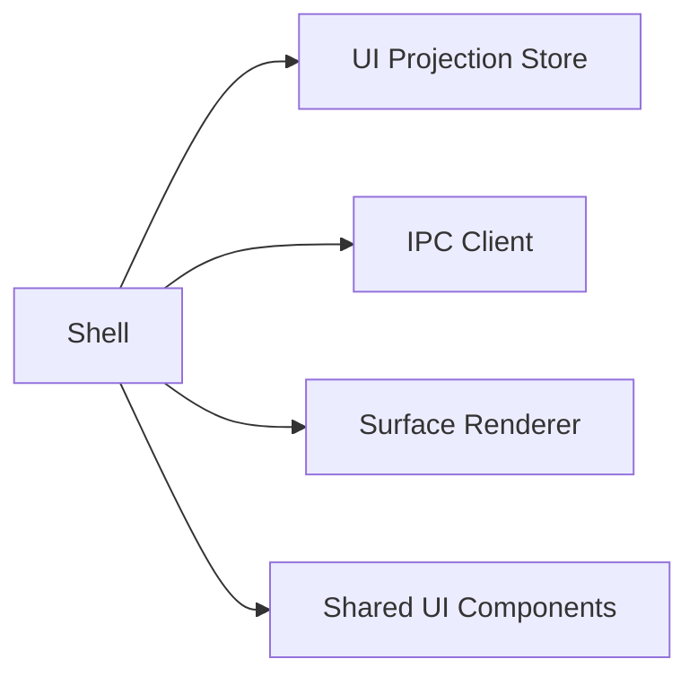

# 01 Shell 模块设计

- 所有权：React
- 位置：`apps/desktop/src/shell`
- 上游：[总体架构](../AgentOS-总体架构.md)

## 目标

提供 AgentOS 窗口级交互框架：顶部唯一树路径、工具栏、当前 Surface 容器、内嵌文本导航、Dialog、通知和焦点恢复。Shell 编排交互，但不实现领域规则。

## 非目标

- 不渲染具体 Element；
- 不计算 Surface 父链或路径解析；
- 不修改权威文档和数据库；
- 不直接启动本地应用或 Agent Worker。

## 依赖



## 内部组件

| 组件 | 职责 |
| --- | --- |
| `AppShell` | 窗口布局、错误边界和启动状态 |
| `BreadcrumbBar` | 展示 Rust 返回的唯一父链，触发导航命令 |
| `CommandToolbar` | 构建、编辑、Move/Copy/Delete 命令入口 |
| `EmbeddedTextNavigator` | 当前 Surface 内收起/展开的文本导航 |
| `DialogHost` | 确认、构建任务和授权 Dialog 的焦点管理 |
| `NotificationCenter` | 消费结构化通知和诊断 ID |
| `SurfaceViewport` | 挂载 Renderer 并维护视口滚动上下文 |

## 公共接口

```ts
export interface ShellProps {
  ipc: AgentOsIpcClient;
  projection: UiProjectionStore;
}

export type ShellCommand =
  | { type: "navigate"; surfaceId: string }
  | { type: "submitBuild"; surfaceId: string; request: string }
  | { type: "enterEditMode" }
  | { type: "resolveConfirmation"; confirmationId: string; accepted: boolean };
```

Shell 只发出语义命令，不构造 SQL、ChangeSet 或内部数据库 ID。

## 状态

Shell 瞬时状态包括当前 Dialog、菜单、文本导航草稿、焦点返回点和 viewport scroll。`currentSurfaceId`、breadcrumb 和 BuildTask 来自 Projection Store，不在 Shell 复制权威值。

## 关键流程

1. 启动时显示 loading frame，并请求 Runtime snapshot。
2. snapshot 到达后渲染路径和当前 Surface。
3. 用户点击 breadcrumb，Shell 调用 `navigationOpenSurface`。
4. 用户提交文本导航，Shell 调用 `navigationResolvePath`；多结果时原位展示候选。
5. 确认成功跳转后，Projection event 更新路径，Shell 恢复输入焦点。

## 错误与恢复

- 启动失败：显示阻断式恢复页和 audit ID。
- 命令失败：保留用户输入，在控件附近显示结构化错误。
- WebView error boundary：重建表现层，但不清空 Runtime 或数据库。
- 事件断流：禁用写操作并请求完整 snapshot 重同步。

## 安全与可访问性

- 禁止 `dangerouslySetInnerHTML` 展示 Agent 文本。
- 所有 Dialog 使用焦点圈定，关闭后恢复触发点。
- breadcrumb、图标按钮和状态具有可访问名称。
- `Escape` 仅关闭最上层 UI，不隐式执行领域操作。

## 测试

- React Testing Library：路径、焦点、Dialog、错误状态。
- Contract mock：命令参数与错误 envelope。
- Playwright：键盘遍历、文本导航、确认和 Surface 切换。
- 视觉回归：桌面、城市 Surface、内嵌文本导航。

## 验收标准

1. Shell 无 Repository、SQLx、进程和文件系统依赖。
2. breadcrumb 始终使用 Projection 提供的路径。
3. 所有写动作可追踪到一个类型化 IPC command。
4. 事件断流时不会继续提交基于旧 revision 的写操作。
