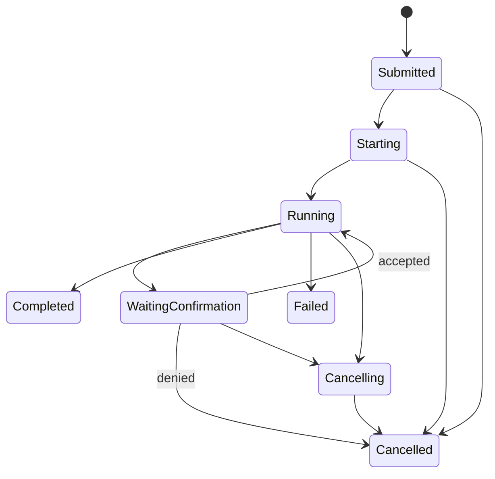

# 10 Build Orchestrator 模块设计

- 所有权：Rust/Tokio
- crate：`crates/agentos-application::build`

## 目标

协调 BuildTask、AgentSession、Agent Worker、Model Gateway、Agent System API、用户确认、取消、超时和最终状态。

## 非目标

不解释模型自然语言输出、不直接修改 `GuiDocument`、不执行 SQL、不向 Worker 提供 Shell 或文件系统。

## 状态机



每次 transition 由明确 command/event 驱动并写审计记录。Terminal 状态不可重新进入 Running。

## 内部组件

| 组件 | 职责 |
| --- | --- |
| `BuildService` | 创建、查询、取消任务 |
| `SessionFactory` | 计算 capability/scope 和过期时间 |
| `WorkerSupervisor` | spawn、stdio、心跳、终止和资源限制 |
| `ConfirmationCoordinator` | 持久化确认请求并等待 Shell 决定 |
| `ProgressReducer` | 单调进度和阶段更新 |
| `BuildRecovery` | 应用重启后的任务恢复或终止 |

## 接口

```rust
pub trait BuildOrchestrator {
    async fn submit(&self, request: BuildRequest, actor: UserId) -> Result<BuildTask, BuildError>;
    async fn cancel(&self, task_id: BuildTaskId, actor: UserId) -> Result<(), BuildError>;
    async fn resolve_confirmation(&self, decision: ConfirmationDecision) -> Result<(), BuildError>;
    async fn recover_incomplete(&self) -> Result<RecoverySummary, BuildError>;
}
```

## Worker 生命周期

Host 创建一次性 session credential，经继承管道或只读 fd 传递，不写 command line、prompt 或日志。Worker 必须发送 ready/heartbeat。取消顺序：撤销 capability、发送 graceful cancel、超时后 kill、等待 reap。

## 并发

MVP 默认最多一个写入型 AgentSession，可允许多个只读分析 session。BuildTask 使用自己的 cancellation token；Host 退出时统一取消。progress 只允许单调增加，阶段变化可重置阶段内百分比但总进度不回退。

## 恢复

应用重启后 Submitted 可重新排队；Starting/Running/WaitingConfirmation 因 Worker 已失效而转为 interrupted/failed，保留用户可重试入口。绝不假装后台 Worker 仍在运行。

## 安全

- capability 最小化并绑定 BuildTask scope。
- 用户确认只能由 Shell 记录。
- Worker stdout 仅用于协议，stderr 进入限长脱敏日志。
- 输入、消息、调用次数、运行时长和并发均设限。

## 测试

- 全状态 transition table。
- cancel 与 commit race、确认拒绝、worker crash、heartbeat timeout。
- session revoke 后 API 调用失败。
- 重启恢复和 terminal state 幂等。
- Tokio paused time 测试超时，无真实 sleep。

## 验收标准

1. 取消任务先撤销能力再终止 Worker。
2. Worker 崩溃不会留下 building 状态假象。
3. 任何领域变更都可关联 buildTaskId、sessionId、transactionId。
4. Orchestrator 不依赖 SQLx adapter，只依赖 Repository port。
