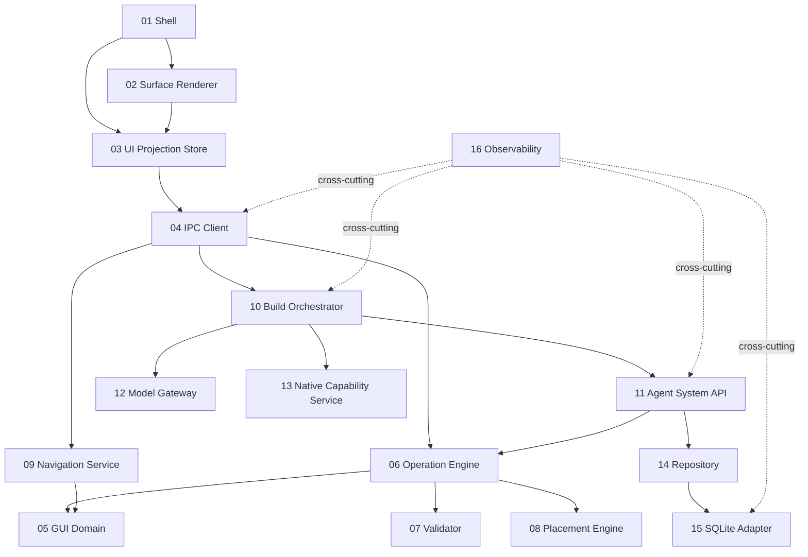

# AgentOS 模块设计索引

本目录将 [AgentOS 总体架构](../AgentOS-总体架构.md) 的模块表拆分为可实施的模块设计。模块文档负责内部结构、接口、状态、错误、安全和测试；跨模块决策仍以总体架构和 ADR 为准。

## 文档清单

| 编号 | 模块 | 所有权 | 设计文档 |
| --- | --- | --- | --- |
| 01 | Shell | React | [Shell](01-shell.md) |
| 02 | Surface Renderer | React | [Surface Renderer](02-surface-renderer.md) |
| 03 | UI Projection Store | Zustand | [UI Projection Store](03-ui-projection-store.md) |
| 04 | IPC Client | TypeScript | [IPC Client](04-ipc-client.md) |
| 05 | GUI Domain | Rust | [GUI Domain](05-gui-domain.md) |
| 06 | Operation Engine | Rust | [Operation Engine](06-operation-engine.md) |
| 07 | Validator | Rust | [Validator](07-validator.md) |
| 08 | Placement Engine | Rust | [Placement Engine](08-placement-engine.md) |
| 09 | Navigation Service | Rust | [Navigation Service](09-navigation-service.md) |
| 10 | Build Orchestrator | Rust/Tokio | [Build Orchestrator](10-build-orchestrator.md) |
| 11 | Agent System API | Rust | [Agent System API 模块](11-agent-system-api.md) |
| 12 | Model Gateway | Rust trait | [Model Gateway](12-model-gateway.md) |
| 13 | Native Capability Service | Rust | [Native Capability Service](13-native-capability-service.md) |
| 14 | Repository | Rust traits | [Repository](14-repository.md) |
| 15 | SQLite Adapter | SQLx | [SQLite Adapter](15-sqlite-adapter.md) |
| 16 | Observability | tracing | [Observability](16-observability.md) |

## 依赖地图

## 统一约束

1. Rust Domain 不依赖 Tauri、Tokio、SQLx、React 或模型 SDK。
2. React 只消费公共 DTO 和事件，不导入数据库实体。
3. 所有领域写入经 `Operation Engine`，UI 与 Agent 都不能直接写 Repository。
4. Agent 只能通过 `Agent System API` 使用系统能力。
5. Repository 是应用层 port；SQLite Adapter 是基础设施实现。
6. 跨边界请求携带 request ID；领域提交携带 revision、transaction ID 和 audit ID。
7. 模块公开接口必须有 contract test；安全边界必须有拒绝路径测试。

## 模块文档模板

每份文档至少包含：

- 目标与非目标；
- 职责和依赖；
- 内部组件；
- 公共接口或事件；
- 状态与不变量；
- 关键流程；
- 错误与恢复；
- 安全要求；
- 测试与验收标准；
- 待决事项。
